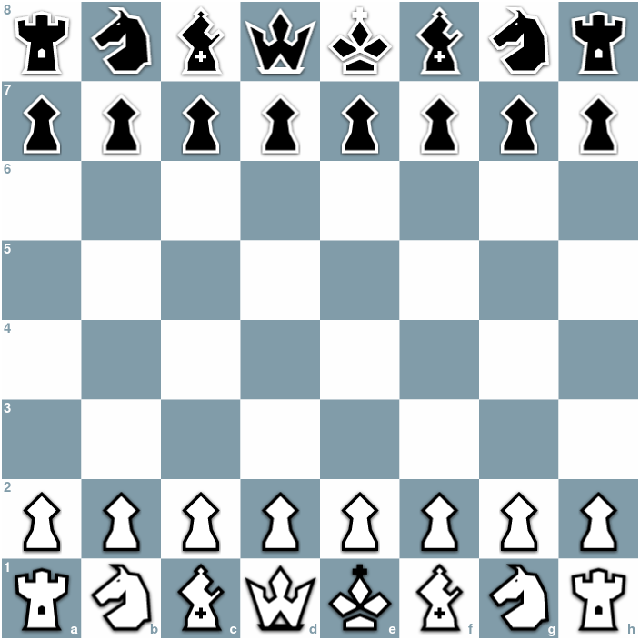

# ChessedBoard

A simple, canvas-based, implementation of a chess board.



## Design

The chess board component is built using 6 canvas elements stacked on top of one another organized in the following manner.

1. Chess board Layer (bottom)

* The layer on which the squares and coordinates are drawn.

2. Bottom Persistent Animation Layer

* The layer on which persisted animations are to be drawn. These animations are above the board but below the pieces.

3. Bottom Animation Layer

* A layer for drawing animations below the pieces. Usually during user interaction. These animations will typically be cleared on each new user interaction. If the animation should persist between many user interactions, it should be saved to the persistent animation layer.

4. Piece Layer

* The layer on which the pieces are drawn.

5. Top Persistent Animation Layer

* The layer on which persisted animations are to be drawn. These animations are above the board and above the pieces.

6. Top Animation Layer (top)

* A layer for drawing animations above the pieces. Usually during user interaction. These animations will typically be cleared on each new user interaction. If the animation should persist between many user interactions, it should be saved to the persistent animation layer.


## API

### Simple Usage

```html
<script  src="../src/index.js">  </script>

<div  id="chessboard"></div>

<script>

const  config = {
    orientation:  1
};

const  chessboard = new  ChessedBoard('chessboard', config);

</script>
```

### Config


| **Property** | **Description** |
|--|--|
| state | The state of the chess board in [FEN](https://en.wikipedia.org/wiki/Forsyth%E2%80%93Edwards_Notation) notation. |
| orientation | 0 for normal orientation. 1 for black view. |
| coordinates | Determines if coordinates are displayed. Default: false |
| movementEnabled | Enables moving the chess pieces. Default: true |
| modulePath | Relative location of the chessed-board module to your project. |
| onLeftClick | Chessed Event Handler which is triggered when the user left clicks on the chess board.|
| onLeftClickDrag | Chessed Event Handler which is triggered when the user moves the mouse around the chess board while left clicking.|
| onLeftClickRelease | Chessed Event Handler which is triggered when the user stops left clicking.|
| onRightClick | Chessed Event Handler which is triggered when the user right clicks on the chess board.|
| onRightClickDrag | Chessed Event Handler which is triggered when the user moves the mouse around the chess board while right clicking.|
| onRightClickRelease | Chessed Event Handler which is triggered when the user stops right clicking.|
| onMouseOut | Chessed Event Handler which is triggered when the user moves their mouse off of the chess board.|
| onLoad | Chessed Event Handler which is triggered when the chess board is loaded and ready for use.|
| onCancel | Chessed Event Handler which is triggered when moving a piece is canceled. In other words, this is invoked when the piece is put back mid move.|
| onResize | Event handler which is triggered when the chess board is resized. This can occur when the window is resized. The handler will be passed the new dimensions of the board. |

### Methods

| **Signature** | **Description** |
|--|--|
| ChessedBoard(div, config, root) | The constructor. |
| movePiece(from, to) | Moves a piece from one square on the board to another.|
| removePiece(from) | Removes a piece from a square.|
| putPieceOnBoard(type, color, square) | Places a given piece on a given square on the board.|
| flip() | Flips the orientation of the board. |
| toggleCoordinates() | Show or hide coordinates. |
| getSquare(square) | Get information about the location of the square on the chess board. |
| getBoardDimensions() | Return an object containing the dimensions of the chess board. |
| animateBelow(animationFunction, type) | Takes a function which renders graphics on the chess board below the pieces. |
| animateAbove(animationFunction, type) | Takes a function which renders graphics on the chess board above the pieces. |
| persistBottomAnimations() | Persists any animations currently drawn on the bottom animation layer. |
| persistTopAnimations() | Persists any animations currently drawn on the top animation layer. |
| clearBottomAnimations() | Clears any animations bottom animation layer which haven't been persisted. |
| clearTopAnimations() | Clears any animations top animation layer which haven't been persisted. |
| clearPersistedBottomAnimations() | Clears any animations bottom animation layer which have been persisted. |
| clearPersistedTopAnimations() | Clears any animations top animation layer which have been persisted. |
| displayPromotionOptions(square, color, callback) | Prompts the user to select a piece during promotion. |
| removeAnimation(animation) | Removes the given animation based on its identifier field. |
| removeAnimationsByType(type) | Removes the all animations matching the provided type. |